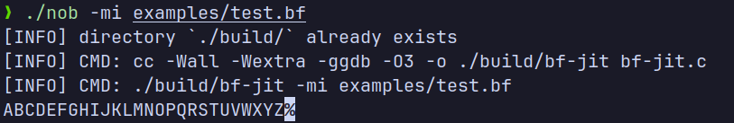
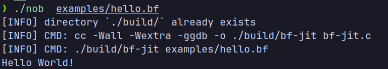

# bf-jit

> A simple jit compiler for BrainFuck with some additional commands

## Inspiration

Who doesn't want to go ahead and make a programming language and that comes with further challenges, like writing a compiler, lsp, and other tooling around it. So to get started I just wanted to write a compiler for the programming language that reached a pinnacle, BrainFuck. With it's minimal instruction set it was pretty easy to write a compiler for it in plain old `C` and `x86 assembly`

> Works only on `x86 Unix` systems

## Quick Start

```console
$ cc -o nob nob.c
$ nob ./examples/hello.bf
```

## Examples





## References

- <https://en.wikipedia.org/wiki/Brainfuck>
- <https://flatassembler.net>
- <https://chromium.googlesource.com/chromiumos/docs/+/master/constants/syscalls.md>
- <https://www.felixcloutier.com/x86/>
